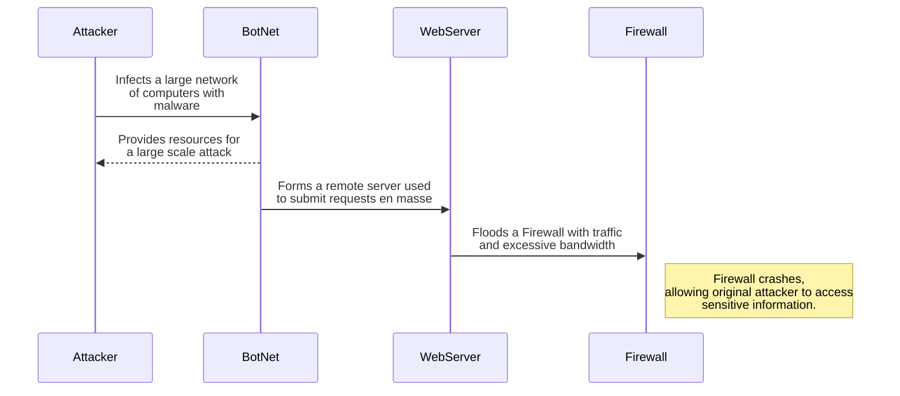

```mermaid

sequenceDiagram
  participant Attacker
  participant BotNet
  participant WebServer
  participant Firewall

  Attacker->>BotNet: Infects a large network<br/> of computers with<br/> malware
  BotNet-->>Attacker: Provides resources for<br/> a large scale attack

  BotNet->>WebServer: Forms a remote server used<br/> to submit requests en masse
  WebServer->>Firewall: Floods a Firewall with traffic<br/> and excessive bandwidth

  Note right of Firewall: Firewall crashes,<br/> allowing original attacker to access<br/>sensitive information. 

```
